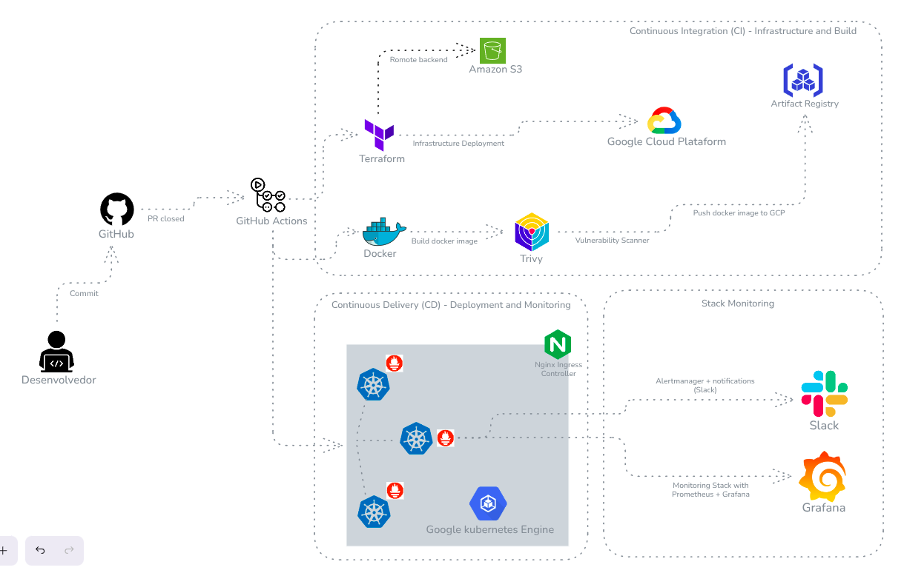

# Projeto de Observabilidade em GKE com Stack Prometheus

Este projeto de portfólio demonstra a implementação de uma stack completa de observabilidade para uma aplicação conteinerizada em um cluster Google Kubernetes Engine (GKE). A automação de infraestrutura (IaC), integração e entrega contínua (CI/CD) são os pilares desta arquitetura, utilizando ferramentas modernas de DevOps.




## 📜 Visão Geral

O objetivo principal é construir um ambiente robusto e observável, onde uma aplicação Python (FastAPI) é implantada no GKE. A observabilidade é alcançada através da stack `kube-prometheus-stack`, que inclui Prometheus para coleta de métricas, Grafana para visualização em dashboards e Alertmanager para gerenciamento de alertas, com notificações enviadas para o Slack.

## ✨ Features

- **Infraestrutura como Código (IaC):** Provisionamento automatizado da VPC e do cluster GKE no Google Cloud usando Terraform e módulos reutilizáveis.
- **CI/CD com GitHub Actions:**
    - **CI:** Build da imagem Docker, análise de vulnerabilidades com **Trivy** e push para o Google Artifact Registry a cada pull request fechado.
    - **CD:** Deploy automatizado da aplicação e da stack de monitoramento no GKE após a conclusão bem-sucedida do pipeline de CI.
- **Observabilidade Completa:**
    - **Métricas:** Coleta de métricas da aplicação (customizadas), do cluster Kubernetes e dos nós através do Prometheus.
    - **Visualização:** Dashboards pré-configurados e customizáveis no Grafana para análise visual das métricas.
    - **Alertas:** Regras de alerta customizadas no Prometheus e gerenciamento de alertas com o Alertmanager, notificando canais no Slack.
- **Aplicação Instrumentada:** API em FastAPI que já expõe métricas de negócio e de performance no formato Prometheus.

## 🛠️ Tecnologias Utilizadas

- **Cloud:** Google Cloud Platform (GCP)
- **Orquestração de Contêineres:** Google Kubernetes Engine (GKE)
- **Infraestrutura como Código:** Terraform
- **CI/CD:** GitHub Actions
- **Contêineres:** Docker
- **Observabilidade:**
    - Prometheus
    - Grafana
    - Alertmanager
    - Kube-Prometheus-Stack (Helm Chart)
- **Scanner de Vulnerabilidades:** Trivy
- **Aplicação:** Python com FastAPI

## 🚀 Começando

Para replicar este ambiente, siga os passos abaixo.

### Pré-requisitos

- Conta no Google Cloud com um projeto criado.
- `gcloud` CLI instalado e autenticado.
- `terraform` CLI instalado.
- `kubectl` instalado.
- `helm` instalado.
- Conta no GitHub.
- Workspace e canais no Slack para receber os alertas.

### Configuração

1.  **Clonar o Repositório:**
    ```bash
    git clone https://github.com/SEU_USUARIO/gke-observability-k8s.git
    cd gke-observability-k8s
    ```

2.  **Configurar Segredos no GitHub:**
    Configure os seguintes segredos no seu repositório do GitHub (`Settings > Secrets and variables > Actions`):
    - `GCP_PROJECT_ID`: ID do seu projeto no GCP.
    - `GCP_SA_KEY_GKE`: Chave de uma Service Account do GCP com permissões para gerenciar GKE e Artifact Registry (em formato JSON).
    - `GCP_REGION`: Região do GCP para criar os recursos (ex: `us-central1`).
    - `GCP_ARTIFACT_REPO`: Nome do repositório no Artifact Registry.
    - `GKE_CLUSTER_NAME`: Nome do seu cluster GKE.
    - `CRITICAL_URL`: URL do webhook do Slack para alertas críticos.
    - `WARNING_URL`: URL do webhook do Slack para alertas de aviso.

3.  **Provisionar a Infraestrutura com Terraform:**
    - Navegue até o diretório de infraestrutura:
      ```bash
      cd infra/envs/staging
      ```
    - Crie um arquivo `terraform.tfvars` com as variáveis do seu ambiente.
    - Inicialize e aplique o Terraform:
      ```bash
      terraform init
      terraform apply
      ```

### Pipeline de CI/CD

O pipeline é acionado automaticamente:

-   **CI (`ci.yml`):** É executado quando um pull request para as branches `main` ou `staging` é fechado. Ele constrói a imagem Docker, escaneia por vulnerabilidades com o Trivy e, se for seguro, envia a imagem para o Google Artifact Registry.
-   **CD (`cd.yml`):** É executado após a conclusão do workflow de CI. Ele faz o deploy da aplicação no GKE, aplica os manifestos do Kubernetes e instala/atualiza a stack de monitoramento com o Helm.

##  dashboards do Grafana

Após o deploy, você pode acessar os dashboards do Grafana para visualizar as métricas. O acesso é feito através do Ingress (`ingress-grafana.yaml`).

1.  **Obtenha o IP do Ingress:**
    ```bash
    kubectl get ingress ingress-grafana -n monitoring
    ```
2.  Acesse o endereço IP em seu navegador.
    - **Login:** `admin`
    - **Senha:** `prom-operator` (padrão, recomendado alterar)

Você terá acesso a dashboards que mostram a saúde do cluster, o desempenho da aplicação e as métricas de negócio customizadas.